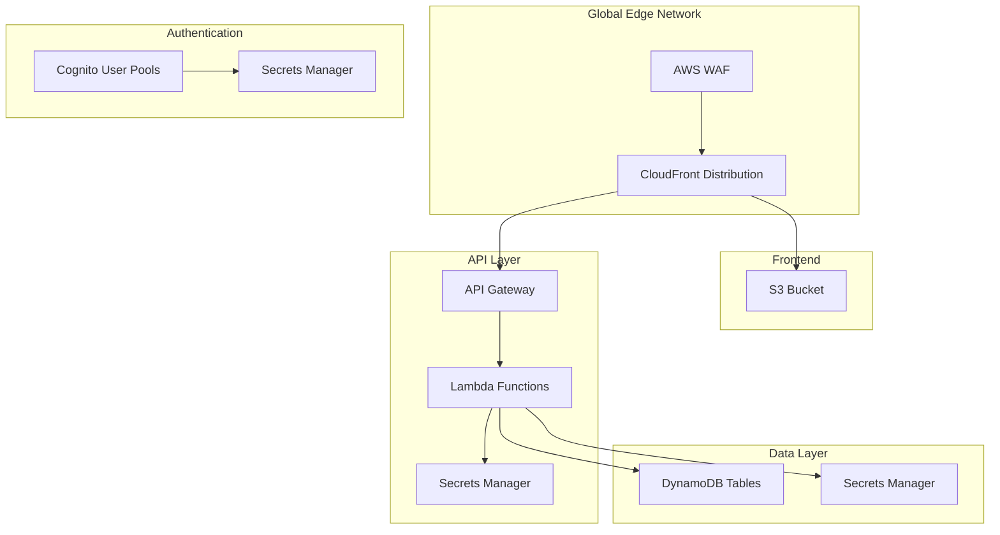
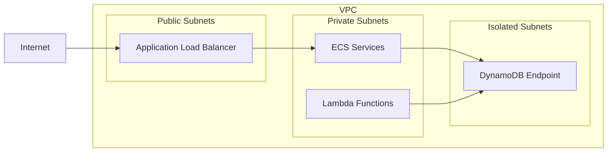
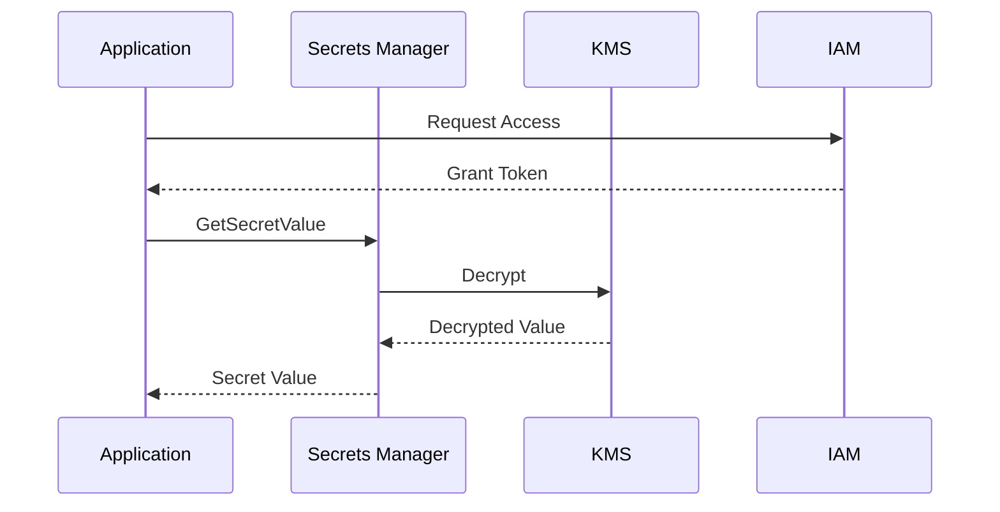

# 🏗️ bjornmelin-platform-io

Cloud-native portfolio platform powering bjornmelin.io. Demonstrates AWS solutions architecture through microservices, serverless APIs, and infrastructure as code. Built with React 19 RC, Next.js 15, AWS CDK, and modern DevOps practices.

[](https://choosealicense.com/licenses/mit/)
[](CONTRIBUTING.md)
[](https://www.credly.com/org/amazon-web-services/badge/aws-certified-solutions-architect-associate)
[](https://www.credly.com/org/amazon-web-services/badge/aws-certified-developer-associate)
[](https://www.credly.com/org/amazon-web-services/badge/aws-certified-cloud-practitioner)
[](https://react.dev)
[](https://nextjs.org/)
[](https://github.com/BjornMelin)
[](https://www.linkedin.com/in/bjorn-melin/)

## 🌟 Features

### Core Platform Features

- 🏗️ **Cloud Native Architecture**: Production-grade AWS infrastructure with CDK
- 🔐 **Enterprise Security**: Zero-trust architecture with AWS Cognito
- 🚀 **CI/CD Pipeline**: Automated deployments with GitHub Actions
- 📊 **Observability**: Comprehensive monitoring and logging
- 🔄 **Multi-Environment**: Development, staging, and production
- 🛡️ **Infrastructure as Code**: Complete AWS CDK implementation
- 📱 **Modern Frontend**: Next.js with Tailwind CSS
- 🌐 **Global Delivery**: CloudFront CDN integration

### Modern Tech Features

- ⚡ **React 19 RC Integration**

  - Document Metadata API
  - Asset Loading API
  - Progressive Loading
  - Optimization Compiler

- 🚀 **Next.js 15 App Router**

  - Server Components
  - Partial Prerendering
  - Parallel Routes
  - Edge Runtime

- 🔄 **Full-Stack Type Safety**

  - End-to-end typesafe APIs with tRPC
  - Runtime validation
  - Strict TypeScript
  - Comprehensive error handling

- ⚡ Performance First

  - Edge deployment
  - Streaming SSR
  - Smart bundling
  - Optimal caching

## 📚 Quick Links

- [🏛️ Architecture](#️-architecture)
- [📁 Project Structure](#-project-structure)
- [🚀 Getting Started](#-getting-started)
- [🛠️ Tech Stack](#️-tech-stack)
- [🏗️ AWS Services Integration](#️-aws-services-integration)
- [💻 Development Scripts](#-development-scripts)
- [👨‍💻 Author](#-author)
- [📜 License](#-license)
- [🌟 Star History](#-star-history)
- [🙏 Acknowledgments](#-acknowledgments)

## 🏛️ Architecture

### System Architecture



### Network Architecture



### Secrets Access Pattern



## 📁 Project Structure

```bash
bjornmelin-platform-io/
├── app/                   # Next.js 15 App Router
│   ├── (auth)/            # Auth routes
│   ├── (portfolio)/       # Portfolio routes
│   └── api/               # Edge API routes
├── infrastructure/        # CDK infrastructure code
│   ├── lib/
│   │   ├── constructs/    # Reusable CDK constructs
│   │   └── stacks/        # AWS CDK stacks
├── services/              # Microservices
│   ├── auth/              # Authentication service
│   └── api/               # Main API service
└── docs/                  # Documentation
```

### Core Components

- **Frontend**: Next.js 15 static site hosted on S3/CloudFront
- **Authentication**: Custom Cognito service with social providers
- **API Gateway**: Centralized API management
- **Services**: Event-driven microservices architecture
- **Database**: DynamoDB with global tables
- **CDN**: CloudFront with global edge locations
- **Monitoring**: CloudWatch with custom dashboards

## 🚀 Getting Started

### Prerequisites
```bash
Node.js >= 20.0.0
pnpm >= 8.0.0
AWS CLI configured
```

### Initial Setup

```bash
# Clone repository
git clone https://github.com/bjornmelin/bjornmelin-platform-io.git
cd bjornmelin-platform-io

# Install dependencies
pnpm install

# Configure AWS credentials
aws configure

# Configure environment
cp .env.example .env.local
```

### Infrastructure Deployment

```bash
# Deploy base infrastructure
cd infrastructure
pnpm run cdk deploy
```

### Local Development

```bash
# Start frontend
cd frontend && pnpm dev

# Start API
cd services/api && pnpm dev
```

## 🛠️ Tech Stack

```yaml
Frontend:
  Core:
    - React 19 RC
    - Next.js 15
    - TypeScript 5.4

  UI:
    - Tailwind CSS
    - shadcn/ui
    - Framer Motion

  Data:
    - TanStack Query
    - tRPC Client
    - Zod

Backend:
  Core:
    - Edge Runtime
    - Node.js 20
    - tRPC

  Infrastructure:
    - AWS CDK
    - DynamoDB
    - CloudFront
    - Lambda Edge
    - Secrets Manager

Development:
  Tools:
    - pnpm
    - Turborepo
    - Vitest
    - Playwright
```

## 🏗️ AWS Services Integration

### Core Services
- **CloudFront**: Global content delivery with edge computing
- **Route53**: DNS management and routing policies
- **WAF**: Web application firewall and security rules
- **ACM**: Certificate management and SSL/TLS

### Compute Services
- **Lambda**: Serverless functions with edge capabilities
- **ECS**: Container orchestration with Fargate
- **EC2**: Infrastructure hosts (minimal usage)

### Storage Services
- **S3**: Static assets and website hosting
- **DynamoDB**: NoSQL database with global tables
- **EFS**: Container storage when needed

### Security Services
- **Cognito**: User authentication and authorization
- **Secrets Manager**: Secure secrets storage and rotation
- **KMS**: Encryption key management
- **IAM**: Fine-grained access control

### Developer Tools
- **CodeBuild**: CI/CD build processes
- **CodePipeline**: Deployment automation
- **CloudWatch**: Monitoring and alerting
- **X-Ray**: Distributed tracing

## 💻 Development Scripts

- `pnpm run deploy:base` - Deploy base infrastructure
- `pnpm run deploy:frontend` - Deploy frontend application
- `pnpm run deploy:auth` - Deploy authentication service
- `pnpm run deploy:api` - Deploy API service

## 👨‍💻 Author

### Bjorn Melin

[](https://www.credly.com/org/amazon-web-services/badge/aws-certified-solutions-architect-associate)
[](https://www.credly.com/org/amazon-web-services/badge/aws-certified-developer-associate)
[](https://www.credly.com/org/amazon-web-services/badge/aws-certified-cloud-practitioner)

AWS-certified Solutions Architect and Developer with expertise in cloud architecture and modern development practices. Connect with me on:

- [GitHub](https://github.com/BjornMelin)
- [LinkedIn](https://www.linkedin.com/in/bjorn-melin/)

## 📜 License

This project is licensed under the MIT License - see the [LICENSE](LICENSE) file for details.

## 🌟 Star History

[](https://star-history.com/#bjornmelin/bjornmelin-platform-io&Date)

## 🙏 Acknowledgments

- AWS Documentation and Best Practices
- AWS CDK Patterns Community
- Next.js Documentation

---

<div align="center">

Built with React 19 RC + Next.js 15 by [Bjorn Melin](https://bjornmelin.io)

</div>
