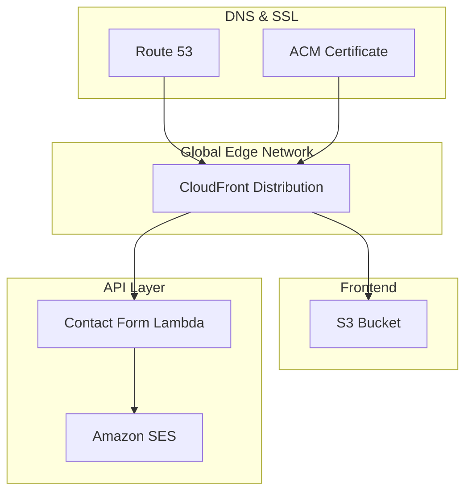
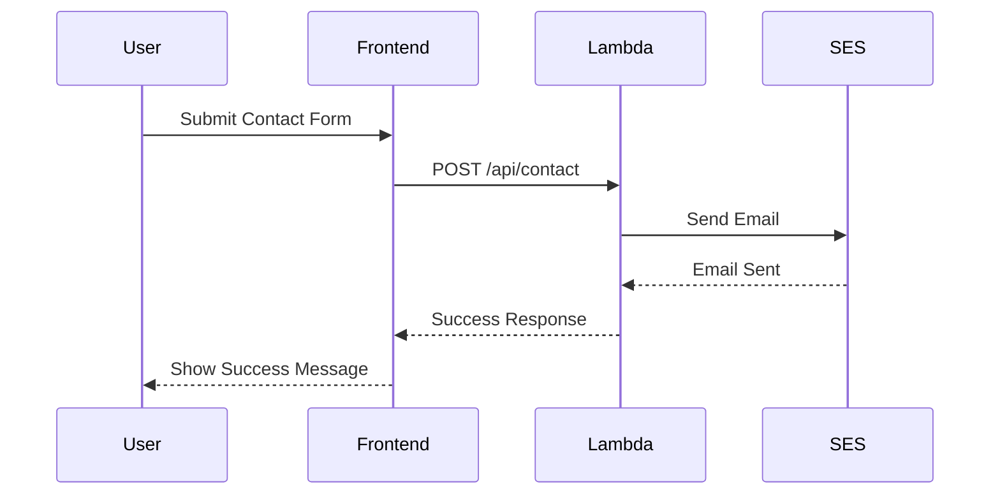
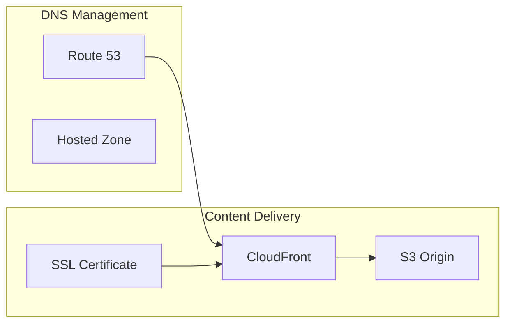

# 🏗️ bjornmelin-platform-io

Cloud-native portfolio platform powering bjornmelin.io. Demonstrates AWS solutions architecture through serverless APIs and infrastructure as code. Built with React 18, Next.js 14, AWS CDK, and modern DevOps practices.

[](https://choosealicense.com/licenses/mit/)
[](https://www.credly.com/org/amazon-web-services/badge/aws-certified-solutions-architect-associate)
[](https://www.credly.com/org/amazon-web-services/badge/aws-certified-developer-associate)
[](https://www.credly.com/org/amazon-web-services/badge/aws-certified-sysops-administrator-associate)
[](https://www.credly.com/org/amazon-web-services/badge/aws-certified-machine-learning-engineer-associate)
[](https://www.credly.com/org/amazon-web-services/badge/aws-certified-ai-practitioner)
[](https://www.credly.com/org/amazon-web-services/badge/aws-certified-cloud-practitioner)
[](https://react.dev)
[](https://nextjs.org/)
[](https://github.com/BjornMelin)
[](https://www.linkedin.com/in/bjorn-melin/)
[](https://www.coursera.org/learner/bjorn-melin)
[](https://medium.com/@bjornmelin)

## 🌟 Features

### Core Platform Features

- 🏗️ **Cloud Native Architecture**: Production-grade AWS infrastructure with CDK
- 🔐 **Enterprise Security**: Zero-trust architecture with AWS Cognito
- 🚀 **CI/CD Pipeline**: Automated deployments with GitHub Actions
- 📊 **Observability**: Comprehensive monitoring and logging
- 🔄 **Multi-Environment**: Development, staging, and production
- 🛡️ **Infrastructure as Code**: Complete AWS CDK implementation
- 📱 **Modern Frontend**: Next.js with Tailwind CSS
- 🌐 **Global Delivery**: CloudFront CDN integration

### Modern Tech Features

- ⚡ **React 18 RC Integration**

  - Document Metadata API
  - Asset Loading API
  - Progressive Loading
  - Optimization Compiler

- 🚀 **Next.js 14 App Router**

  - Server Components
  - Partial Prerendering
  - Parallel Routes
  - Edge Runtime

- 🔄 **Full-Stack Type Safety**

  - End-to-end typesafe APIs with tRPC
  - Runtime validation
  - Strict TypeScript
  - Comprehensive error handling

- ⚡ Performance First

  - Edge deployment
  - Streaming SSR
  - Smart bundling
  - Optimal caching

## 📚 Quick Links

- [🏛️ Architecture](#️-architecture)
- [📁 Project Structure](#-project-structure)
- [🚀 Getting Started](#-getting-started)
- [🛠️ Tech Stack](#️-tech-stack)
- [🏗️ AWS Services Integration](#️-aws-services-integration)
- [💻 Development Scripts](#-development-scripts)
- [👨‍💻 Author](#-author)
- [📜 License](#-license)
- [🌟 Star History](#-star-history)
- [📚 How to Reference](#-how-to-reference)
- [🙏 Acknowledgments](#-acknowledgments)

## 🏛️ Architecture

### System Architecture



### Contact Form Flow



### DNS & CDN Setup



## 📁 Project Structure

```bash
bjornmelin-platform-io/
├── .github/                # GitHub Actions workflows
├── docs/                  # Project documentation
│   ├── api/              # API documentation
│   ├── architecture/     # Architecture docs
│   ├── deployment/       # Deployment guides
│   ├── development/      # Development guides
│   └── security/         # Security docs
├── infrastructure/        # CDK infrastructure code
│   ├── bin/              # CDK app entry
│   └── lib/              # Infrastructure code
│       ├── functions/    # Lambda functions
│       ├── stacks/       # CDK stacks
│       └── types/        # Stack types
├── public/               # Static assets
│   ├── certifications/   # AWS certifications
│   ├── headshot/        # Profile images
│   └── projects/        # Project images
├── src/                  # Application source
│   ├── app/             # Next.js 14 App Router
│   │   ├── api/         # API routes
│   │   └── fonts/       # Custom fonts
│   ├── components/      # React components
│   ├── data/           # Static data
│   ├── hooks/          # Custom hooks
│   ├── lib/            # Utilities
│   └── types/          # TypeScript types
```

### Core Components

- **Frontend**: Next.js 14 application with App Router
- **Infrastructure**: AWS CDK for cloud resource management
- **CI/CD**: GitHub Actions for automated deployments
- **CDN**: CloudFront with Route 53 DNS
- **API**: Serverless Lambda functions with SES integration

## 🚀 Getting Started

### Prerequisites

```bash
Node.js >= 18.0.0
yarn >= 4.0.0
AWS CLI configured
```

### Initial Setup

```bash
# Clone repository
git clone https://github.com/bjornmelin/bjornmelin-platform-io.git
cd bjornmelin-platform-io

# Install dependencies
yarn install

# Configure AWS credentials
aws configure

# Configure environment
cp .env.production .env.local
```

### Infrastructure Deployment

```bash
# Deploy infrastructure
cd infrastructure
yarn install
yarn cdk deploy
```

### Local Development

```bash
# Start development server
yarn dev
```

## 🛠️ Tech Stack

```yaml
Frontend:
  Core:
    - React 18
    - Next.js 14
    - TypeScript

  UI:
    - Tailwind CSS
    - shadcn/ui
    - Framer Motion
    - GeistVF Font

Infrastructure:
  Core:
    - AWS CDK
    - CloudFront
    - S3
    - Route 53
    - ACM
    - Lambda
    - SES

Development:
  Tools:
    - yarn 4.0
    - ESLint
    - Prettier
    - TypeScript
    - PostCSS
```

## 🏗️ AWS Services Integration

### Core Services

- **CloudFront**: Global content delivery network
- **Route53**: DNS management and domain routing
- **ACM**: SSL/TLS certificate management
- **S3**: Static website hosting and assets

### Compute & Messaging Services

- **Lambda**: Serverless contact form handling
- **SES**: Email delivery for contact form

### Development & Deployment

- **CDK**: Infrastructure as code
- **GitHub Actions**: CI/CD automation
- **CloudWatch**: Basic monitoring and logging

### Security Services

- **IAM**: Role-based access control
- **WAF**: Basic security rules (optional)

## 💻 Development Scripts

```bash
# Development
yarn dev          # Start development server
yarn build        # Build production application
yarn start        # Start production server
yarn lint         # Run ESLint
yarn serve        # Serve production build locally

# Infrastructure (in /infrastructure directory)
yarn cdk deploy   # Deploy AWS infrastructure
```

## 👨‍💻 Author

### Bjorn Melin

[](https://www.credly.com/org/amazon-web-services/badge/aws-certified-solutions-architect-associate)
[](https://www.credly.com/org/amazon-web-services/badge/aws-certified-developer-associate)
[](https://www.credly.com/org/amazon-web-services/badge/aws-certified-sysops-administrator-associate)
[](https://www.credly.com/org/amazon-web-services/badge/aws-certified-machine-learning-engineer-associate)
[](https://www.credly.com/org/amazon-web-services/badge/aws-certified-ai-practitioner)
[](https://www.credly.com/org/amazon-web-services/badge/aws-certified-cloud-practitioner)

AWS-certified Solutions Architect, Developer, SysOps Administrator, and Machine Learning Engineer with expertise in cloud architecture and modern development practices. Connect with me on:

- [GitHub](https://github.com/BjornMelin)
- [LinkedIn](https://www.linkedin.com/in/bjorn-melin/)
- [Coursera](https://www.coursera.org/learner/bjorn-melin)
- [Medium](https://medium.com/@bjornmelin)

## 📜 License

This project is licensed under the MIT License - see the [LICENSE](LICENSE) file for details.

## 🌟 Star History

[](https://star-history.com/#bjornmelin/bjornmelin-platform-io&Date)

## 📚 How to Reference

If you use this project in your research or work, please cite it as:

```bibtex
@misc{melin2024portfolio,
  author = {Melin, Bjorn},
  title = {bjornmelin-platform-io: Cloud-Native Portfolio Platform},
  year = {2024},
  publisher = {GitHub},
  journal = {GitHub repository},
  howpublished = {\url{https://github.com/bjornmelin/bjornmelin-platform-io}},
  commit = {main}
}
```

Standard Citation:

```
Melin, B. (2024). bjornmelin-platform-io: Cloud-Native Portfolio Platform [Computer software]. GitHub. https://github.com/bjornmelin/bjornmelin-platform-io
```

## 🙏 Acknowledgments

- AWS Documentation and Best Practices
- AWS CDK Patterns Community
- Next.js Documentation

---

<div align="center">

Built with React 18 + Next.js 14 by [Bjorn Melin](https://bjornmelin.io)

</div>
