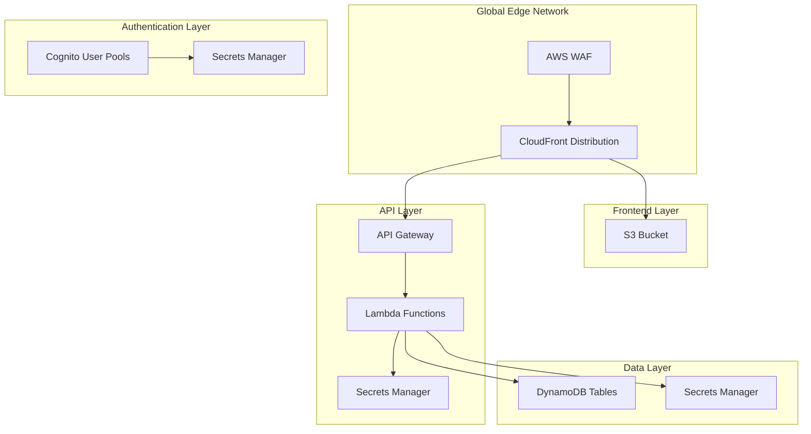
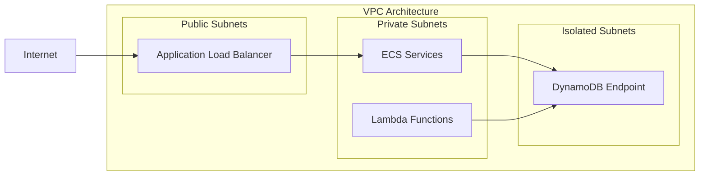
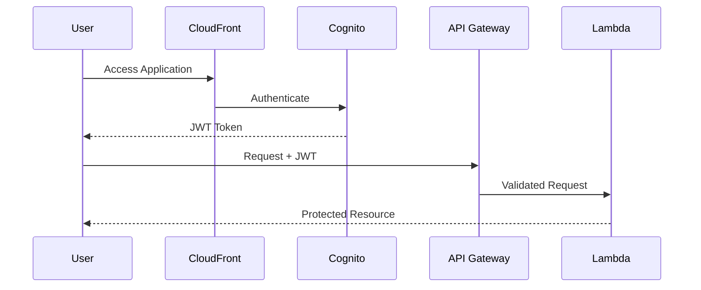
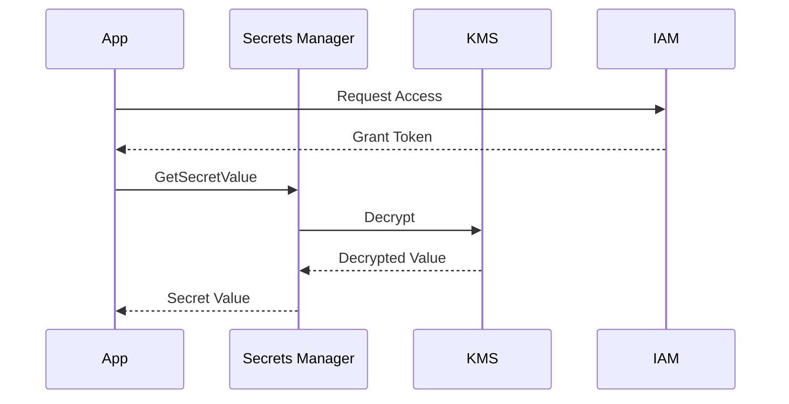

# Architecture Overview

## Table of Contents

- [System Architecture](#system-architecture)
- [Core Components](#core-components)
- [AWS Services](#aws-services)
- [Design Decisions](#design-decisions)
- [Security Architecture](#security-architecture)

## System Architecture

### High-Level Overview



### Network Architecture



## Core Components

### Frontend (Next.js 15)

- **Technology**: React 19 RC with Next.js 15
- **Hosting**: S3 + CloudFront
- **Features**:
  - Server Components
  - Edge Runtime
  - Static Site Generation
  - Dynamic Rendering

### API Layer

- **Design**: RESTful + tRPC
- **Implementation**: Lambda + API Gateway
- **Features**:
  - Type-safe APIs
  - Edge Functions
  - Request Validation
  - Rate Limiting

### Authentication

- **Provider**: AWS Cognito
- **Features**:
  - Social Login
  - JWT Tokens
  - MFA Support
  - Session Management

### Data Storage

- **Primary**: DynamoDB
- **Features**:
  - Global Tables
  - Auto-scaling
  - Point-in-time Recovery
  - Encryption at Rest

## AWS Services

### Compute Services

```yaml
Lambda:
  Use Cases:
    - API Endpoints
    - Background Jobs
    - Event Processing
  Features:
    - Edge Computing
    - Event Triggers
    - VPC Integration

ECS:
  Use Cases:
    - Long-running Services
    - Background Workers
  Features:
    - Fargate Runtime
    - Auto-scaling
    - Load Balancing
```

### Storage Services

```yaml
S3:
  Use Cases:
    - Static Assets
    - User Uploads
    - Website Hosting
  Features:
    - Versioning
    - Lifecycle Policies
    - CDN Integration

DynamoDB:
  Use Cases:
    - User Data
    - Application State
    - Session Management
  Features:
    - Global Tables
    - Streams
    - Backup/Restore
```

### Security Services

```yaml
Cognito:
  Features:
    - User Management
    - Identity Federation
    - OAuth 2.0 Flows
    - Token Management

Secrets Manager:
  Features:
    - Secret Rotation
    - Fine-grained Access
    - Encryption
    - Audit Logging
```

## Design Decisions

### Edge Computing

- **Why**: Improved latency and global performance
- **Implementation**: CloudFront + Lambda@Edge
- **Benefits**:
  - Reduced latency
  - Global availability
  - Cost optimization

### Serverless Architecture

- **Why**: Scalability and cost efficiency
- **Implementation**: Lambda + DynamoDB
- **Benefits**:
  - Auto-scaling
  - Pay-per-use
  - Reduced maintenance

### Security First

- **Why**: Enterprise-grade security
- **Implementation**: Zero-trust architecture
- **Features**:
  - Secrets rotation
  - Encryption at rest
  - Fine-grained access control

## Security Architecture

### Authentication Flow



### Secrets Management



For more detailed information about specific components, please refer to:

- [Frontend Architecture](./frontend.md)
- [Backend Architecture](./backend.md)
- [Infrastructure Design](./infrastructure.md)
- [AWS Services Documentation](./aws-services.md)
