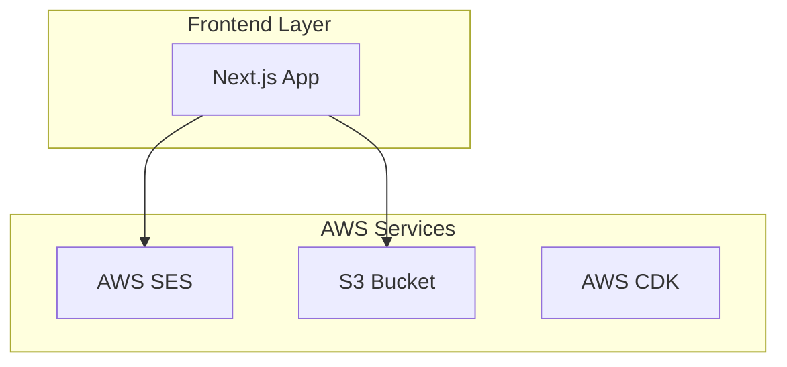
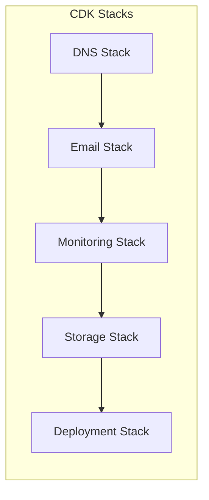

# Architecture Overview

## Table of Contents

- [System Architecture](#system-architecture)
- [Core Components](#core-components)
- [AWS Services](#aws-services)
- [Design Decisions](#design-decisions)

## System Architecture

### High-Level Overview



### Infrastructure Architecture



## Core Components

### Frontend (Next.js 13+)

- **Technology**: React with Next.js 13+ App Router
- **Features**:
  - Server Components
  - App Router
  - Static Site Generation
  - API Routes

### API Layer

- **Design**: Next.js API Routes
- **Implementation**: Serverless Functions
- **Features**:
  - Type-safe APIs
  - Request Validation
  - Error Handling
  - Contact Form Endpoint

### Email Service

- **Provider**: AWS SES
- **Features**:
  - Contact Form Processing
  - Email Templates
  - Error Handling
  - Delivery Monitoring

### Static Assets

- **Storage**: S3
- **Features**:
  - Project Images
  - Public Assets
  - Certifications
  - Profile Images

## AWS Services

### Email Service (SES)

```yaml
SES:
  Use Cases:
    - Contact Form Emails
  Features:
    - Email Templates
    - Delivery Monitoring
    - Error Handling
```

### Storage Service (S3)

```yaml
S3:
  Use Cases:
    - Static Assets
    - Public Files
  Features:
    - Versioning
    - Lifecycle Policies
```

### Infrastructure (CDK)

```yaml
CDK Stacks:
  - DNS Stack
  - Email Stack
  - Monitoring Stack
  - Storage Stack
  - Deployment Stack
```

## Design Decisions

### Next.js App Router

- **Why**: Modern React features and improved performance
- **Implementation**: Server Components and App Directory
- **Benefits**:
  - Improved performance
  - Better SEO
  - Type safety
  - Server-side rendering

### Serverless Architecture

- **Why**: Simplicity and cost efficiency
- **Implementation**: Next.js API Routes + AWS Services
- **Benefits**:
  - Low maintenance
  - Cost effective
  - Easy scaling
  - Simple deployment

### Infrastructure as Code

- **Why**: Reproducible and version-controlled infrastructure
- **Implementation**: AWS CDK
- **Benefits**:
  - Version control
  - Type safety
  - Easy updates
  - Documentation

For more detailed information about specific components, please refer to:

- [Frontend Architecture](./frontend.md)
- [Backend Architecture](./backend.md)
- [Infrastructure Design](./infrastructure.md)
- [AWS Services Documentation](./aws-services.md)
