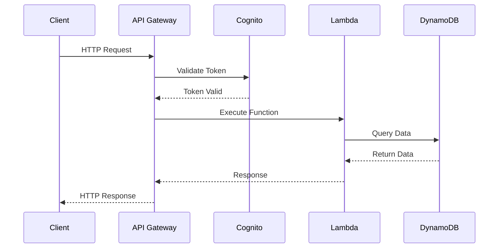
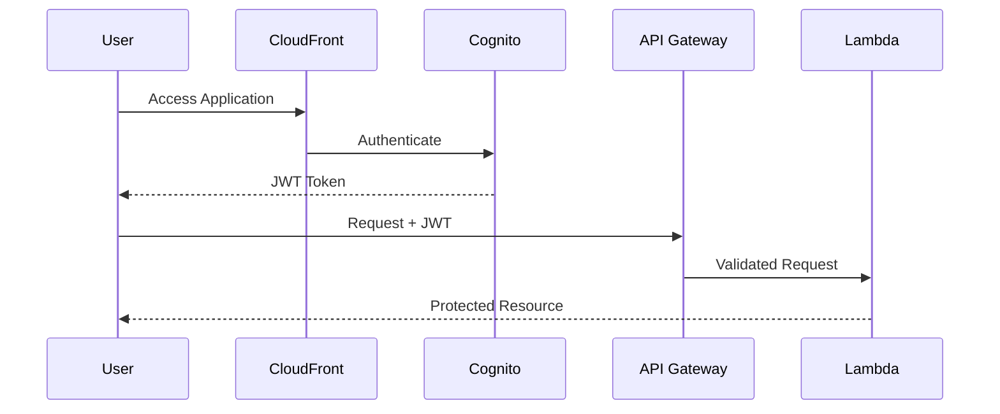
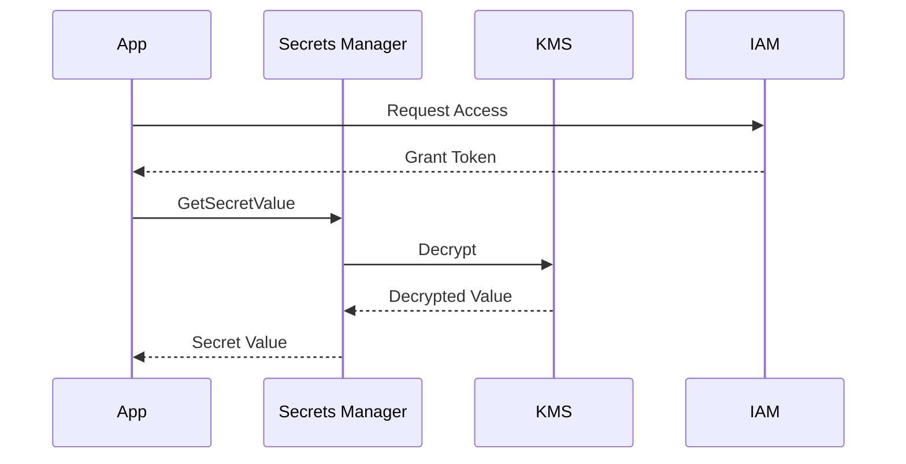

# Backend Architecture

## Overview

The backend architecture follows a serverless-first approach using AWS services, implementing a microservices pattern for scalability and maintainability.

## Core Components

### API Layer

#### API Gateway

- RESTful API endpoints
- tRPC integration
- Request validation
- Rate limiting
- API key management

#### Lambda Functions

- Edge computing capability
- Event-driven processing
- VPC integration
- Custom runtimes

### Authentication Service

#### Cognito Integration

- User management
- Social login providers
- JWT token handling
- MFA support
- Password policies

### Data Layer

#### DynamoDB

- Global tables
- Auto-scaling
- Backup/restore
- Stream processing
- Secondary indexes

### Security

#### Secrets Management

- Rotation policies
- Encryption
- Access control
- Audit logging

## Service Architecture

## Error Handling

- Global error middleware
- Custom error types
- Error logging
- Client-friendly messages

## Monitoring

- CloudWatch metrics
- X-Ray tracing
- Custom dashboards
- Alerting

## Authentication Flow

## Secrets Access Pattern

## Design Decisions

### Edge Computing

- **Why**: Improved latency and global performance
- **Implementation**: CloudFront + Lambda@Edge
- **Benefits**:
  - Reduced latency
  - Global availability
  - Cost optimization

### Serverless Architecture

- **Why**: Scalability and cost efficiency
- **Implementation**: Lambda + DynamoDB
- **Benefits**:
  - Auto-scaling
  - Pay-per-use
  - Reduced maintenance
