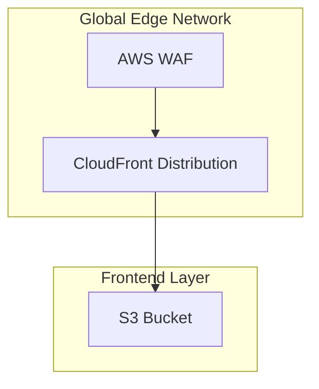

# Frontend Architecture

## Technology Stack

### Core Framework

- React 19 RC
- Next.js 15
- TypeScript 5.4

### UI Layer

- Tailwind CSS
- shadcn/ui
- Framer Motion

### Data Management

- TanStack Query
- tRPC Client
- Zod validation

## Key Features

### React 19 RC Features

- Document Metadata API
- Asset Loading API
- Progressive Loading
- Optimization Compiler

### Next.js 15 Capabilities

- Server Components
- Partial Prerendering
- Parallel Routes
- Edge Runtime

### Performance Optimizations

- Edge deployment
- Streaming SSR
- Smart bundling
- Optimal caching

## Architecture Patterns

### Component Structure

```
components/
├── ui/               # Base UI components
├── features/         # Feature-specific components
├── layouts/          # Layout components
└── shared/           # Shared components
```

### State Management

- Server state with TanStack Query
- Form state with React Hook Form
- UI state with React Context
- Validation with Zod

### Routing

- App Router
- Dynamic routes
- Middleware
- Loading states

## Deployment

### Build Process

- Static site generation
- Dynamic paths
- Image optimization
- Font optimization

### CDN Integration

- CloudFront distribution
- Edge caching
- Asset optimization
- Global deployment

## Frontend Layer Architecture



## Security Features

### Zero-Trust Architecture

- JWT token validation
- Request signing
- API authentication
- CORS policies

### Edge Security

- WAF integration
- DDoS protection
- Rate limiting
- Geo-restrictions

## Design Decisions

### Server Components

- Improved performance
- Reduced client bundle
- Better SEO
- Simplified data fetching

### Edge Runtime

- Global deployment
- Reduced latency
- Improved reliability
- Cost optimization
