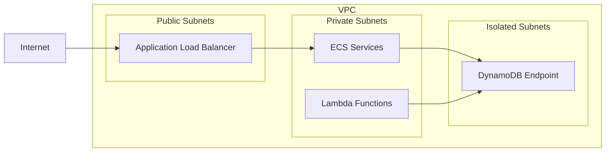
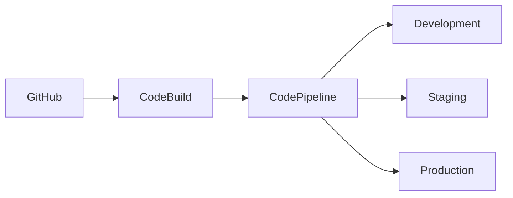
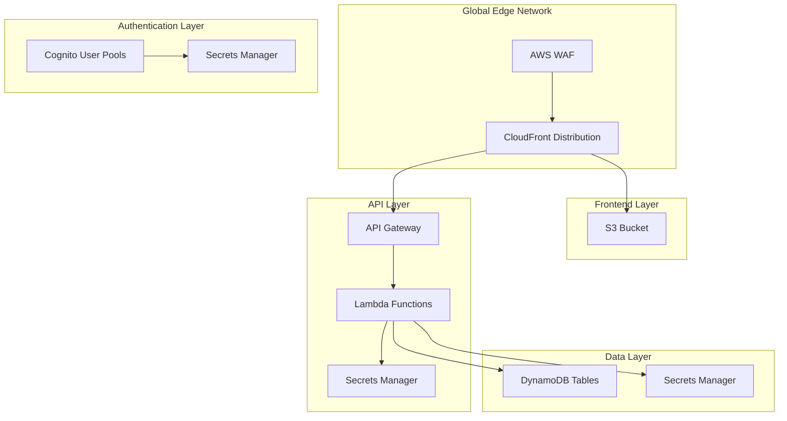

# Infrastructure Design

## Network Architecture

### VPC Design



## Infrastructure as Code

### AWS CDK Implementation

- TypeScript-based CDK
- Reusable constructs
- Environment separation
- Best practices

### Stack Organization

```
infrastructure/
├── lib/
│   ├── constructs/    # Reusable components
│   └── stacks/        # Main stacks
├── bin/               # Entry points
└── test/              # Infrastructure tests
```

## Security Architecture

### Network Security

- VPC design
- Security groups
- NACLs
- VPC endpoints

### Access Control

- IAM roles
- Service policies
- Resource policies
- Least privilege

### Encryption

- KMS integration
- TLS encryption
- At-rest encryption
- In-transit encryption

## Monitoring & Logging

### CloudWatch Integration

- Metrics collection
- Log aggregation
- Dashboards
- Alerts

### X-Ray Tracing

- Service maps
- Trace analysis
- Performance monitoring
- Error tracking

## Deployment Strategy

### Multi-Environment Support

- Development
- Staging
- Production
- Feature environments

### CI/CD Pipeline



## Disaster Recovery

### Backup Strategy

- Automated backups
- Cross-region replication
- Point-in-time recovery
- Retention policies

### High Availability

- Multi-AZ deployment
- Auto-scaling
- Load balancing
- Failover configurations

## Security First Approach

### Zero-Trust Architecture

- No implicit trust
- Always verify
- Least privilege access
- Continuous validation

### Enterprise-Grade Security Features

- Secrets rotation
- Encryption at rest
- Fine-grained access control
- Audit logging

## Global Architecture



## Edge Computing Strategy

### Global Distribution

- CloudFront edge locations
- Regional deployments
- Content optimization
- Dynamic routing

### Performance Optimization

- Edge caching
- Request collapsing
- Origin shield
- Real-time metrics
