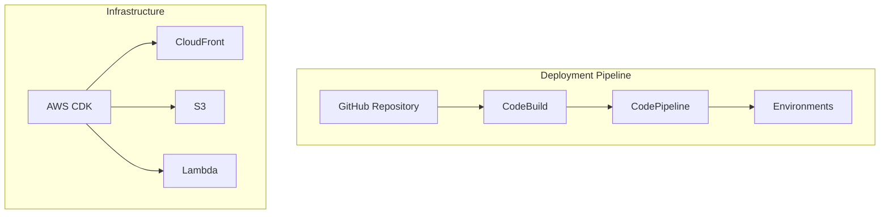

# Deployment Overview

## Deployment Strategy

Our deployment strategy follows a multi-environment approach with automated CI/CD pipelines and comprehensive monitoring.

### Key Components

### Environment Strategy

- Development (dev)
- Staging (stage)
- Production (prod)
- Feature environments

### Deployment Process

1. Code commit triggers pipeline
2. Automated testing
3. Infrastructure validation
4. Staged deployments
5. Production release

### Key Features

- Zero-downtime deployments
- Automated rollbacks
- Infrastructure as Code
- Security checks
- Performance monitoring

## Documentation Structure

- [Environment Configurations](./environments.md)
- [CI/CD Pipeline](./ci-cd.md)
- [Monitoring and Logging](./monitoring.md)
