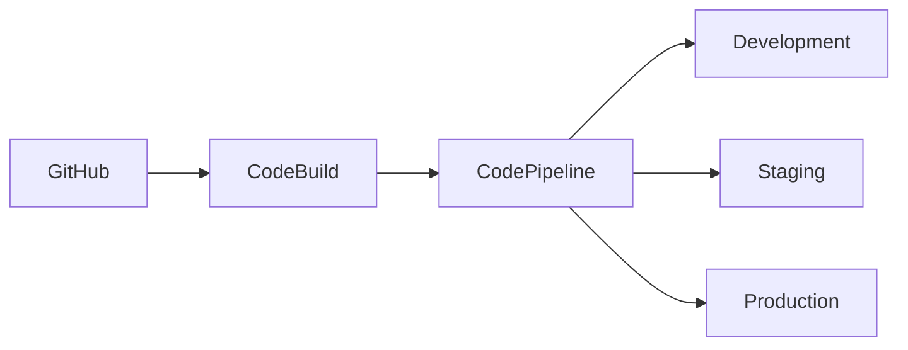

# CI/CD Pipeline Documentation

## Pipeline Overview

## Pipeline Stages

### 1. Source Stage

- GitHub repository integration
- Branch protection rules
- Pull request workflows
- Code review gates

### 2. Build Stage

- **CodeBuild Configuration**
  - Node.js 20 runtime
  - pnpm package manager
  - Custom build containers
  - Caching strategies

### 3. Test Stage

- Unit tests
- Integration tests
- E2E tests
- Security scans

### 4. Deploy Stage

- Infrastructure deployment
- Application deployment
- Configuration updates
- Health checks

## Deployment Workflows

### Feature Development

1. Feature branch creation
2. Development deployment
3. PR creation
4. Automated testing
5. Code review
6. Staging deployment
7. Production deployment

### Hotfix Process

1. Hotfix branch creation
2. Emergency build
3. Expedited testing
4. Production deployment
5. Backport to development

## Security Measures

### Pipeline Security

- Secrets management
- IAM roles
- Audit logging
- Security scanning

### Deployment Security

- Zero-trust model
- Encryption in transit
- Access controls
- Security groups

## Monitoring & Alerts

### Pipeline Monitoring

- Build status
- Deployment health
- Test coverage
- Security alerts

### Deployment Monitoring

- Application metrics
- Infrastructure health
- Performance data
- Error tracking

## Rollback Procedures

### Automated Rollbacks

- Failed deployments
- Health check failures
- Error rate thresholds
- Manual triggers

### Manual Interventions

- Approval gates
- Emergency stops
- Manual rollbacks
- Incident response
