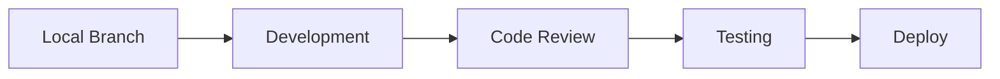

# Development Overview

## Introduction

This section provides comprehensive documentation for developers working on the bjornmelin-platform-io project. Our development process emphasizes code quality, performance, and maintainable architecture.

## Documentation Structure

- [Getting Started](./getting-started.md) - Setup and initial development guide
- [Coding Standards](./coding-standards.md) - Code style and best practices
- [Testing Strategies](./testing.md) - Testing methodologies and tools

## Development Environment

### Prerequisites

- Node.js (v18 or higher)
- Yarn package manager
- AWS CLI configured with appropriate credentials
- Git

### Core Technologies

#### Frontend

- Next.js 13+ (App Router)
- React 18
- TypeScript
- Tailwind CSS
- shadcn/ui components

#### Infrastructure

- AWS CDK
- AWS SES
- AWS S3

#### Development Tools

- ESLint
- Prettier
- Zod for validation
- React Testing Library

## Development Workflow

### 1. Local Development



### 2. Code Quality

- TypeScript for type safety
- ESLint for code linting
- Prettier for code formatting
- Git hooks for pre-commit checks

### 3. Testing Requirements

- Component testing
- API route testing
- Integration testing
- Type checking

## Best Practices

### Code Organization

```
src/
├── app/          # Next.js 13+ pages and API routes
├── components/   # React components
├── lib/          # Utilities and services
├── types/        # TypeScript types
└── data/         # Static data
```

### Performance

- Server Components when possible
- Static generation for applicable pages
- Image optimization
- Code splitting
- Bundle size monitoring

### Type Safety

- Strict TypeScript configuration
- Zod for runtime validation
- Type-safe API routes
- Proper error handling

### Component Development

- Functional components
- React Server Components
- Custom hooks
- Shared utilities
- Proper error boundaries

### State Management

- React Server Components
- Local component state
- Form state management
- Server state handling

### Security

- Input validation
- API route protection
- Environment variable management
- Secure data handling

## Development Commands

```bash
# Start development server
yarn dev

# Build for production
yarn build

# Run type checking
yarn type-check

# Run linting
yarn lint
```

## Infrastructure Development

- AWS CDK for infrastructure
- Local testing of AWS services
- Infrastructure as Code practices
- Environment-based configurations

## Continuous Integration

- Code quality checks
- Type checking
- Test execution
- Build verification

## Documentation

- Inline code documentation
- Component documentation
- API documentation
- Infrastructure documentation

For more detailed information, refer to the specific guides in each section of the development documentation.
