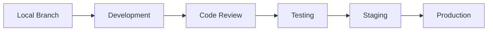

# Development Overview

## Introduction

This section provides comprehensive documentation for developers working on the bjornmelin-platform-io project. Our development process emphasizes code quality, security, and maintainable architecture.

## Documentation Structure

- [Getting Started](./getting-started.md) - Setup and initial development guide
- [Coding Standards](./coding-standards.md) - Code style and best practices
- [Testing Strategies](./testing.md) - Testing methodologies and tools

## Development Environment

### Prerequisites

- Node.js >= 20.0.0
- pnpm >= 8.0.0
- AWS CLI configured
- Git

### Core Technologies

- React 19 RC
- Next.js 15
- TypeScript 5.4
- AWS CDK
- tRPC

## Development Workflow

### 1. Local Development

### 2. Code Quality

- ESLint configuration
- Prettier formatting
- TypeScript strict mode
- Husky pre-commit hooks

### 3. Testing Requirements

- Unit tests
- Integration tests
- E2E tests
- Performance testing

## Best Practices

### Code Organization

- Feature-based structure
- Shared components
- Type-safe APIs
- Documentation

### Performance

- Server Components
- Edge Functions
- Optimized builds
- Caching strategies

### Security

- Security reviews
- Dependency scanning
- Secret management
- Access control
