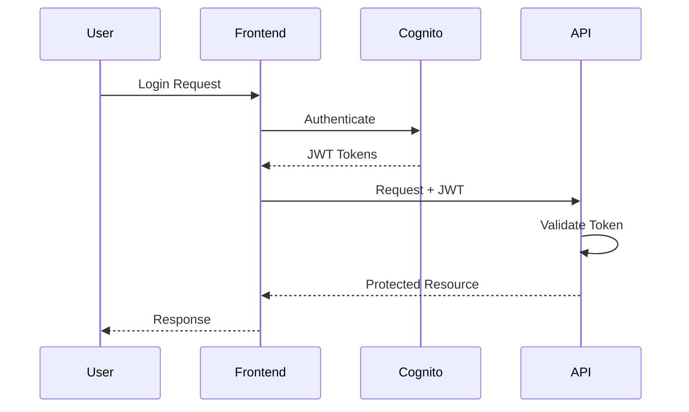

# Authentication Flows

This document provides an overview of the authentication flows used within the bjornmelin-platform-io project.

## Overview

Authentication flows are processes that ensure the identity of users and services interacting with the system. Proper implementation of authentication flows is crucial for maintaining the security and integrity of the system.

## Types of Authentication Flows

1. **OAuth 2.0**: A widely used authorization framework that allows third-party applications to access user resources without exposing credentials.
2. **OpenID Connect**: An identity layer on top of OAuth 2.0 that provides authentication and user information.
3. **SAML**: Security Assertion Markup Language, a standard for exchanging authentication and authorization data between parties.
4. **JWT**: JSON Web Tokens, a compact and self-contained way for securely transmitting information between parties as a JSON object.

## Best Practices

1. **Use Strong Authentication Methods**: Implement multi-factor authentication (MFA) to enhance security.
2. **Secure Token Storage**: Store tokens securely and avoid exposing them in URLs or logs.
3. **Token Expiry and Revocation**: Implement token expiry and revocation mechanisms to minimize the impact of compromised tokens.
4. **Regular Audits**: Conduct regular audits of authentication flows to identify and address potential vulnerabilities.

## Tools and Services

- **OAuth 2.0 Providers**: Services like Auth0, Okta, and AWS Cognito that provide OAuth 2.0 and OpenID Connect support.
- **SAML Providers**: Services like OneLogin and Ping Identity that support SAML-based authentication.
- **JWT Libraries**: Libraries for handling JWTs in various programming languages.

## References

- [OAuth 2.0 Documentation](https://oauth.net/2/)
- [OpenID Connect Documentation](https://openid.net/connect/)
- [SAML Documentation](https://docs.oasis-open.org/security/saml/v2.0/)
- [JWT Documentation](https://jwt.io/introduction/)

## Implementation Details

### JWT Token Structure

```json
{
  "header": {
    "alg": "RS256",
    "typ": "JWT"
  },
  "payload": {
    "sub": "user-id",
    "iss": "auth-service",
    "exp": 1234567890,
    "iat": 1234567890
  }
}
```

### Authentication Sequence



### Token Management

- Access token handling
- Refresh token rotation
- Token revocation
- Session management

### Security Considerations

- Token encryption
- Secure storage
- XSS prevention
- CSRF protection
