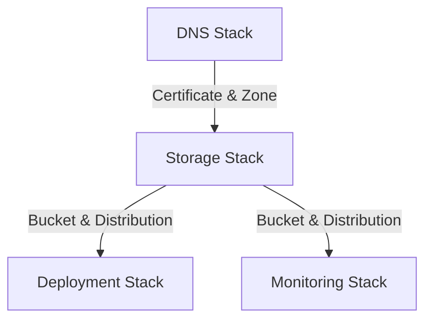

# Infrastructure Documentation

## Stack Architecture

### Overview

The infrastructure is organized into four main stacks:

- DNS Stack: Manages domain and SSL certificates
- Storage Stack: Handles S3 and CloudFront configuration
- Deployment Stack: Manages IAM and deployment credentials
- Monitoring Stack: Configures CloudWatch alarms

### Resource Relationships



### Configuration Details

- Domain: bjornmelin.io
- Environment: Production
- Region: us-east-1 (primary)
- CDK Version: 2.99.1

### Security Measures

- SSL/TLS encryption (TLS 1.2+)
- S3 bucket public access blocked
- Strict security headers
- IAM least privilege access
- DNS validation for certificates

## Deployment Guide

### Prerequisites

- AWS CLI configured
- Node.js 16+
- Yarn package manager
- Domain registered in Route 53

### Configuration Parameters

```typescript
export const CONFIG = {
  prod: {
    domainName: "bjornmelin.io",
    environment: "prod",
  },
};
```

### Deployment Steps

1. Install dependencies:

```bash
cd infrastructure
yarn install
```

2. Deploy stacks in order:

```bash
# Deploy DNS stack first (wait for certificate validation)
yarn deploy:dns

# Deploy remaining stacks
yarn deploy:storage
yarn deploy:deployment
yarn deploy:monitoring
yarn deploy:email
```

### Troubleshooting Steps

1. Certificate Issues:

   - Verify DNS validation records
   - Check certificate region (must be us-east-1)

2. CloudFront Issues:

   - Verify distribution status
   - Check origin access configuration
   - Validate SSL certificate status

3. Deployment Issues:
   - Verify IAM permissions
   - Check GitHub Actions secrets
   - Validate S3 bucket permissions

### Rollback Procedures

```bash
# Rollback specific stack
cdk destroy prod-portfolio-[stack-name]

# Rollback all stacks
yarn destroy:all
```

## Monitoring Documentation

### Available Metrics

1. CloudFront:

   - 5xx Error Rate
   - Cache Hit/Miss Rate
   - Total Requests

2. S3:
   - 4xx Errors
   - Total Requests
   - Bucket Size

### Alarm Thresholds

- CloudFront 5xx Errors: > 5% over 2 periods
- S3 4xx Errors: > 10 errors over 2 periods

### Response Procedures

1. High Error Rates:

   - Check CloudWatch logs
   - Verify origin health
   - Review security configurations

2. Performance Issues:
   - Monitor cache hit rates
   - Check origin response times
   - Verify CloudFront settings

### Maintenance Tasks

1. Regular:

   - Monitor SSL certificate expiration
   - Review CloudWatch alarms
   - Check S3 lifecycle rules

2. Monthly:
   - Review access logs
   - Verify backup retention
   - Check cost optimization
